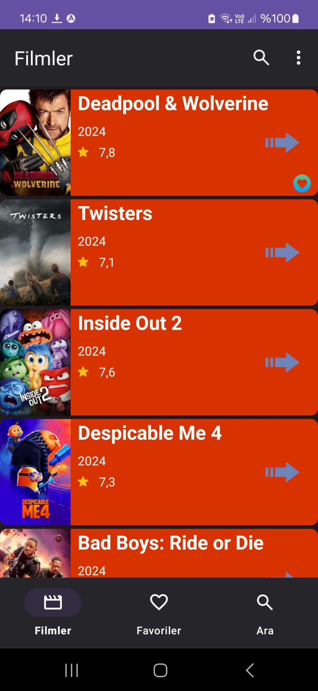
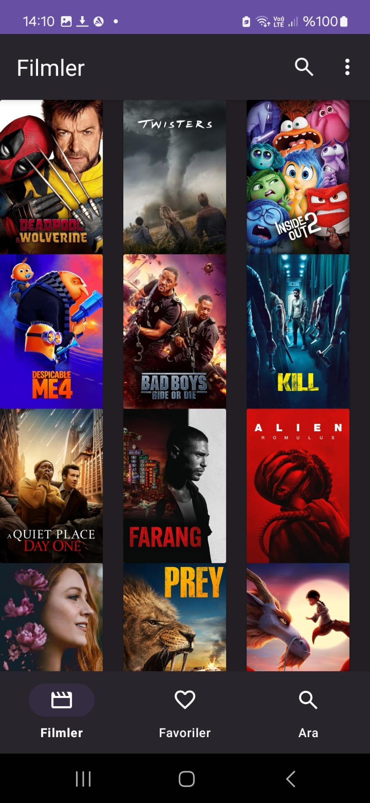
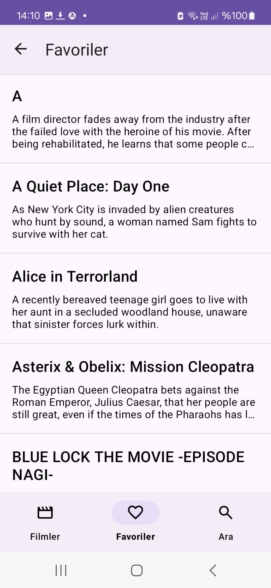
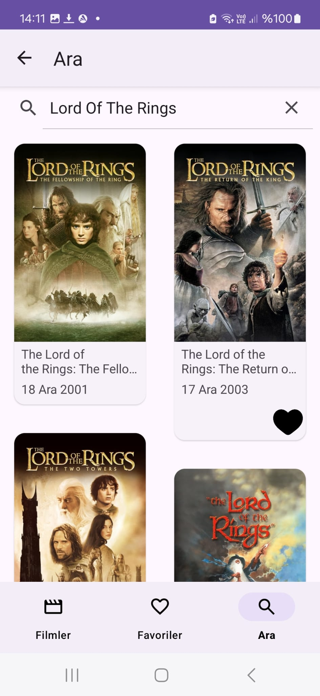
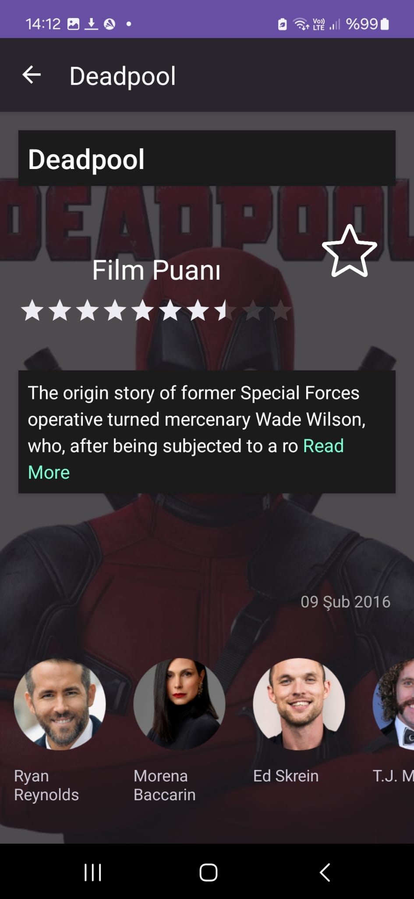

# MovieBox

MovieBox is an Android application that allows users to browse and search for movies using The Movie DB (TMDB) API. Users can also mark movies as favorites and view them in a dedicated favorites screen.

## Features

- **Browse Movies:** View popular movies in either a linear or grid layout.
- **Search Movies:** Search for movies by title.
- **Favorite Movies:** Mark movies as favorites and view them on a dedicated favorites screen.
- **Movie Details:** View detailed information about a movie, including cast and crew.
- **Responsive UI:** The app is optimized for both portrait and landscape orientations.

## Screenshots

### Linear Layout

### Grid Layout

### Favorites Screen

### Search Screen

### Movie Detail Screen

## Demo Video

[Watch the video](https://youtube.com/shorts/XIJ_W9GXXDg?feature=share)

# Libraries Used
1. **Retrofit**
2. **Room**
3. **Hilt (for dependency injection)**
4. **Clean Architecture**
5. **MVVM**
6. **Coroutines**
7. **List Adapter(Specialized type of recycler view)**
8. **Coil (for image loading)**
9. **Paging 3**
10. **View Binding**

    
